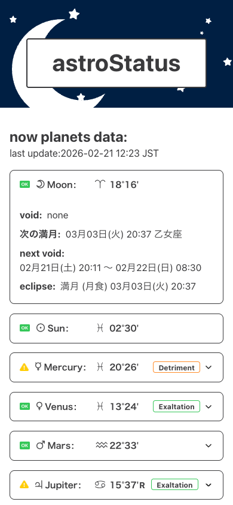
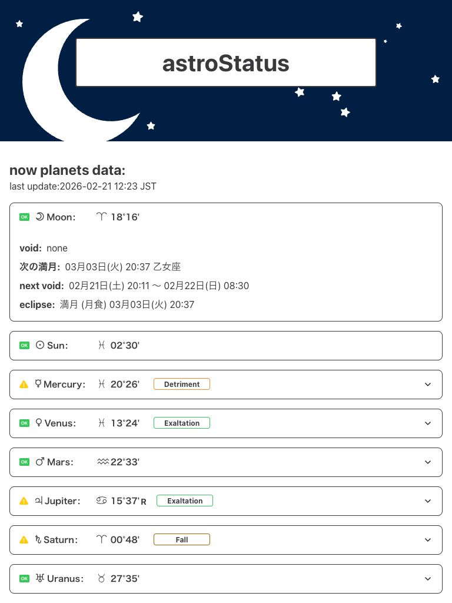
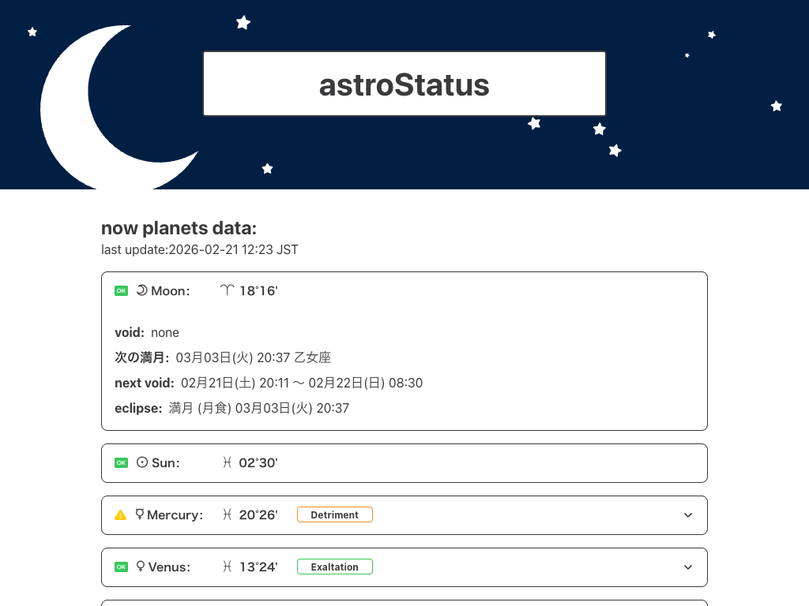
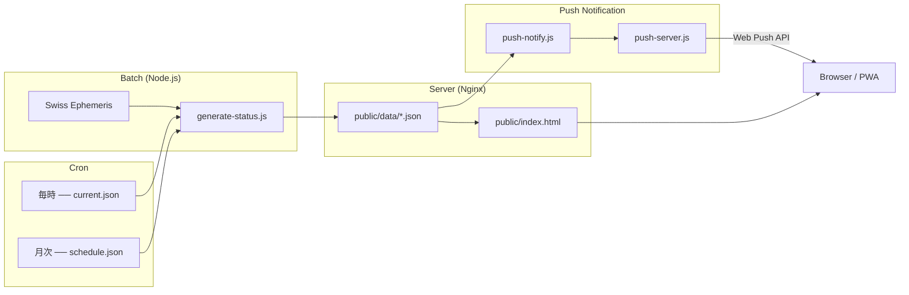

# astroStatus

**Astronomical status dashboard for astrologers** — 天体の状態をひと目で確認できるWebアプリ


<p align="center">
  
  
  
</p>

## Overview

astroStatusは、**天文暦（Swiss Ephemeris）のデータをバッチ処理で定期計算し、ステータスダッシュボード風に可視化する**Webアプリケーションです。

西洋占星術では、天体の逆行（Retrograde）やVoid of Course Moonなど、特定の天体状態がコンサルテーションやイベント計画の判断材料になります。astroStatusは、こうした情報を**ページを開くだけで即座に確認できる**ことを目的としています。

## Features

- **リアルタイム天体ステータス** — 10天体の現在位置・星座・ディグニティをワンビューで表示
- **Void of Course Moon 検知** — ボイドタイムの開始/終了を自動計算、24時間前から事前表示
- **逆行/留/イングレス スケジュール** — 各天体の状態変化を一覧管理、事前通知付き
- **新月/満月カレンダー** — 日食・月食を含むルナーフェーズの自動計算
- **PWA + Web Push通知** — ボイドタイムや水星逆行の開始をプッシュ通知でお知らせ
- **完全静的配信** — Nginxで静的ファイルを返すだけのシンプルなサーバー構成

## Architecture



**データフロー:**
Swiss Ephemeris → バッチ計算（cron） → JSON生成 → 静的HTML配信 → クライアント描画

## Tech Stack

| Layer | Technology |
| ----- | --------- |
| Frontend | HTML / SCSS / Vanilla JS |
| Backend | Node.js ≥ 20.11 |
| Ephemeris | [Swiss Ephemeris](https://www.astro.com/swisseph/) (swisseph) |
| Build | Gulp / Sass |
| Infrastructure | Nginx / cron / pm2 |
| PWA | Service Worker / Web Push API / VAPID |
| Analytics | Google Tag Manager |

## Project Structure

```text
astroStatus/
├── packages/
│   ├── astro-core/           # 天文計算コアモジュール
│   │   └── src/
│   │       ├── services/     #   天体位置計算
│   │       └── utils/        #   アスペクト・ディグニティ
│   └── astro-status/         # ステータス計算モジュール
│       └── src/
│           ├── constants/    #   天体定義
│           └── services/     #   VoC・逆行・月相・天文暦
├── batch/
│   ├── generate-status.js    # JSONデータ生成バッチ
│   ├── push-notify.js        # プッシュ通知判定バッチ
│   └── push-server.js        # 購読管理サーバー (port 3900)
├── public/
│   ├── index.html            # メインページ
│   ├── manifest.json         # PWA マニフェスト
│   ├── sw.js                 # Service Worker
│   ├── data/                 # バッチ生成JSON (gitignore)
│   └── src/
│       ├── scss/             #   スタイルソース
│       ├── css/              #   ビルド済みCSS
│       ├── js/               #   フロントエンドJS
│       └── images/           #   アイコン・画像
├── gulpfile.js               # SCSSビルド設定
└── package.json
```

## Getting Started

### Prerequisites

- Node.js ≥ 20.11
- npm

### Installation

```bash
git clone git@github.com:s-kogure/astroStatus.git
cd astroStatus

# プロジェクトルート（ビルドツール）
npm install

# 計算モジュール
cd packages/astro-core && npm install && cd ../..
cd packages/astro-status && npm install && cd ../..
```

### Development

```bash
# SCSS watchビルド
npm run watch

# 天体データ生成（ローカル確認用）
node batch/generate-status.js
```

### Production

```bash
# current.json: 毎時更新
0 * * * * cd /path/to/astroStatus && node batch/generate-status.js --current-only

# schedule.json: 月次更新
0 3 1 * * cd /path/to/astroStatus && node batch/generate-status.js --schedule-only

# Push通知: 毎時チェック
5 * * * * cd /path/to/astroStatus && node batch/push-notify.js
```

## Roadmap

- [ ] 計算ロジックのnpmパッケージ化・公開（`@astroquery/astro-core`として別リポジトリと並行で整備中）
- [ ] 通知設定のユーザーカスタマイズ（通知天体の選択、時間帯設定）

## Related

- [astroQuery](https://astro-query.com/) — ホラリー占星術向けWebアプリ（姉妹プロジェクト）

## License

This work is licensed under [CC BY-NC 4.0](https://creativecommons.org/licenses/by-nc/4.0/).

非商用での利用・改変・再配布は自由です。商用利用をご検討の場合は事前にご相談ください。
